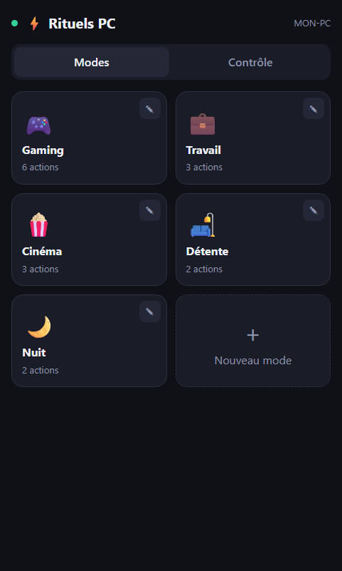
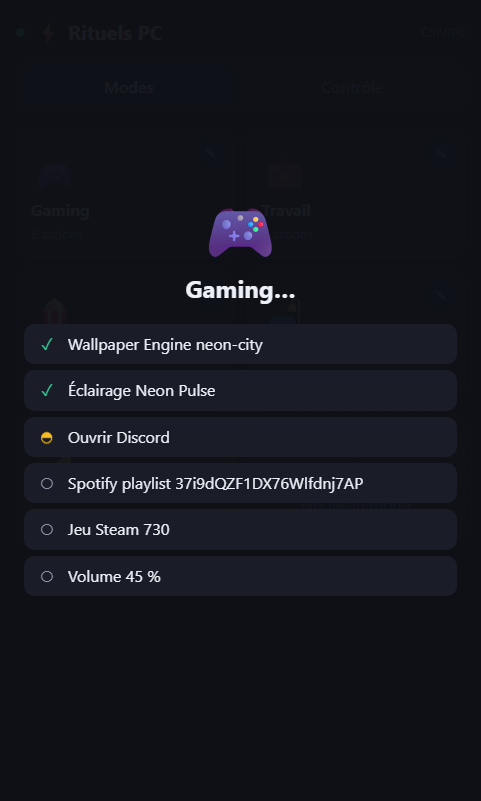
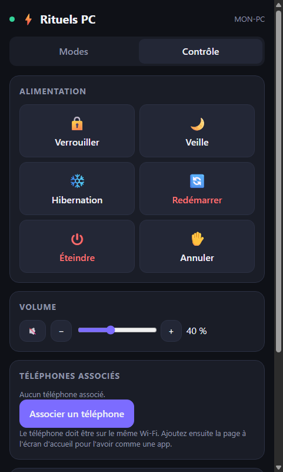

<div align="center">

<picture>
  <source media="(prefers-color-scheme: dark)" srcset="build/logo-dark.svg">
  
</picture>

# Rituels PC

**Lancez tout votre PC en un clic : applis, jeux, musique, éclairage, fond d'écran. Depuis le PC, le téléphone ou la voix.**

[](https://github.com/EaglesFPV/Rituels-PC/releases/latest)
[](https://github.com/EaglesFPV/Rituels-PC/actions/workflows/build.yml)
[](LICENSE)


[**Télécharger**](https://github.com/EaglesFPV/Rituels-PC/releases/latest) ·
[Sécurité](SECURITY.md) ·
[Développement](#développement)




</div>

---

## Le principe

Un **mode** est une suite d'actions exécutées dans l'ordre : ouvrir Discord, lancer un jeu, démarrer une
playlist, appliquer un éclairage, changer le fond d'écran, régler le volume. Vous le déclenchez d'un clic
depuis l'application PC, depuis votre téléphone, avec un raccourci clavier ou à la voix. C'est votre PC qui
exécute tout, en local : aucun compte, aucun serveur, aucun abonnement.

> Projet indépendant, inspiré du concept de PC Rituals. Il n'a ni lien ni code en commun avec ce logiciel.

## Fonctionnalités

| | |
|---|---|
| **Modes** | Autant de modes que vous voulez, chacun avec une icône et jusqu'à 50 actions réordonnables. Une étape en erreur n'arrête pas les suivantes. |
| **Suivi en direct** | Un écran montre chaque action en cours, réussie ou en erreur, sur le PC et sur le téléphone. |
| **Jeux** | Steam, Epic Games, Battle.net et Riot Games (Valorant, League of Legends…). |
| **Services** | Discord, Spotify (collez le lien de partage d'une playlist, d'un album ou d'un morceau), éclairage SignalRGB, fonds animés Wallpaper Engine. |
| **Bureau** | Lancer n'importe quel programme, ouvrir un lien ou un fichier, fond d'écran, volume, fermer un programme, attendre, script PowerShell. |
| **Téléphone** | Association par QR code sur le Wi-Fi local, sans Internet. Chaque téléphone peut être retiré à tout moment. |
| **Alimentation** | Verrouiller, veille, hibernation, redémarrer, éteindre (avec délai et bouton Annuler). |
| **Voix** | Commandes vocales 100 % locales (« lance Gaming »), avec le moteur de reconnaissance de Windows. Désactivées par défaut. |
| **Bureau Windows** | Zone de notification avec la liste des modes, raccourci global **Ctrl + Alt + R**, démarrage avec Windows (facultatif), mises à jour automatiques. |

## Installation

1. Téléchargez **Rituels-PC-Setup-x.y.z.exe** depuis les [Releases](https://github.com/EaglesFPV/Rituels-PC/releases/latest) et lancez-le.
2. L'installateur n'est pas signé numériquement : Windows SmartScreen peut afficher
   « Windows a protégé votre ordinateur ». Cliquez sur **Informations complémentaires › Exécuter quand même**.
3. Au premier lancement, autorisez Rituels PC sur le **réseau privé** dans le pare-feu Windows : c'est ce qui
   permet au téléphone de le joindre.

Les versions installées se mettent à jour automatiquement.

## Associer un téléphone

1. Téléphone et PC sur le même Wi-Fi.
2. Sur le PC : onglet **Contrôle › Associer un téléphone**.
3. Scannez le QR code avec l'appareil photo du téléphone (ou ouvrez l'adresse affichée et saisissez le code).
4. Ajoutez la page à l'écran d'accueil (menu du navigateur › *Ajouter à l'écran d'accueil*) pour l'avoir comme une app.

Le code est valable 5 minutes et ne sert qu'une fois.

<div align="center">

</div>

## Limites actuelles

- **Pas d'app native iPhone / Android** : le téléphone utilise une application web installable sur l'écran d'accueil.
- **Pas de réveil du PC éteint** : le PC doit être allumé (ou en veille) pour recevoir les ordres ; réveiller un
  PC éteint demanderait un appareil toujours allumé sur le réseau.
- **Réseau local uniquement** : rien n'est joignable depuis Internet, et c'est voulu.
- **Spotify** ouvre la playlist ou le morceau ; le lancement de la lecture dépend de Spotify.
- **Installateur non signé** : la signature demande un certificat payant.
- **Windows uniquement** (10 et 11).

## Sécurité

Accès par association d'appareil (jeton aléatoire, seul son hachage est conservé), verrouillage progressif
des essais, protection contre les requêtes venues d'autres sites et contre le « DNS rebinding », politique de
contenu stricte, fenêtre Electron isolée. Le détail et le modèle de menace sont dans [SECURITY.md](SECURITY.md).

## Développement

```bash
npm install
npm start          # lance l'application
npm test           # tests unitaires et d'intégration
npm run dist       # construit l'installateur dans dist/
npm run icon       # régénère les icônes depuis build/logo-dark.svg
```

Structure :

```
src/core       modes, actions, appareils, voix, serveur local (sans dépendance à Electron)
src/main       application de bureau : fenêtre, zone de notification, mises à jour
src/renderer   interface (servie à la fenêtre PC et au téléphone)
test           tests (node --test)
```

Deux workflows GitHub Actions :

- **Build** : à chaque envoi sur `main`, exécute les tests et produit un installateur de développement (artefact).
- **Release** : lancé à la main (*Actions › Release › Run workflow*) avec un numéro de version ; il teste,
  compile, calcule les empreintes SHA-256, crée le tag et publie l'installateur dans les Releases.

## Licence

[MIT](LICENSE)
