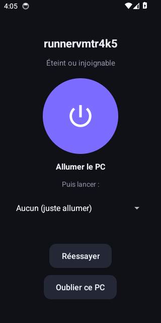
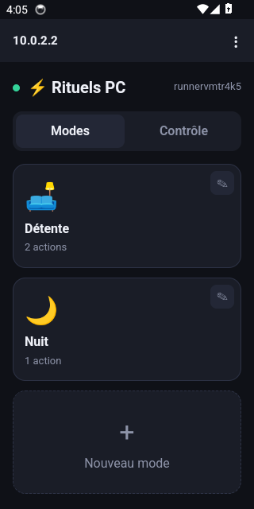

<div align="center">

<picture>
  <source media="(prefers-color-scheme: dark)" srcset="build/logo-dark.svg">
  
</picture>

# Rituels PC

**Lancez tout votre PC en un clic : applis, jeux, musique, éclairage, fond d'écran. Depuis le PC, le téléphone ou la voix.**

[](https://github.com/EaglesFPV/Rituels-PC/releases/latest)
[](https://github.com/EaglesFPV/Rituels-PC/actions/workflows/build.yml)
[](LICENSE)


[**Télécharger**](https://github.com/EaglesFPV/Rituels-PC/releases/latest) ·
[Sécurité](SECURITY.md) ·
[Développement](#développement)


</div>

---

## Le principe

Un **mode** est une suite d'actions exécutées dans l'ordre : ouvrir Discord, lancer un jeu, démarrer une
playlist, appliquer un éclairage, changer le fond d'écran, régler le volume. Vous le déclenchez d'un clic
depuis l'application PC, depuis votre téléphone, avec un raccourci clavier ou à la voix. C'est votre PC qui
exécute tout, en local : aucun compte, aucun serveur, aucun abonnement.

> Projet indépendant, inspiré du concept de PC Rituals. Il n'a ni lien ni code en commun avec ce logiciel.

## Fonctionnalités

| | |
|---|---|
| **Modes** | Autant de modes que vous voulez, chacun avec une icône et jusqu'à 50 actions réordonnables. Une étape en erreur n'arrête pas les suivantes. |
| **Suivi en direct** | Un écran montre chaque action en cours, réussie ou en erreur, sur le PC et sur le téléphone. |
| **Jeux** | Steam, Epic Games, Battle.net et Riot Games (Valorant, League of Legends…). |
| **Services** | Discord, Spotify (collez le lien de partage d'une playlist, d'un album ou d'un morceau), éclairage SignalRGB, fonds animés Wallpaper Engine. |
| **Bureau** | Lancer n'importe quel programme, ouvrir un lien ou un fichier, fond d'écran, volume, fermer un programme, attendre, script PowerShell. |
| **Téléphone** | Association par QR code sur le Wi-Fi local, sans Internet. Chaque téléphone peut être retiré à tout moment. |
| **Allumer le PC** | L'app Android envoie le signal d'allumage (Wake-on-LAN), attend le démarrage de Windows et peut lancer un mode dès que le PC est prêt. |
| **Alimentation** | Verrouiller, veille, hibernation, redémarrer, éteindre (avec délai et bouton Annuler). |
| **Voix** | Commandes vocales 100 % locales (« lance Gaming »), avec le moteur de reconnaissance de Windows. Désactivées par défaut. |
| **Bureau Windows** | Zone de notification avec la liste des modes, raccourci global **Ctrl + Alt + R**, démarrage avec Windows (facultatif), mises à jour automatiques. |

## Installation

1. Téléchargez **Rituels-PC-Setup-x.y.z.exe** depuis les [Releases](https://github.com/EaglesFPV/Rituels-PC/releases/latest) et lancez-le.
2. L'installateur n'est pas signé numériquement : Windows SmartScreen peut afficher
   « Windows a protégé votre ordinateur ». Cliquez sur **Informations complémentaires › Exécuter quand même**.
3. Au premier lancement, autorisez Rituels PC sur le **réseau privé** dans le pare-feu Windows : c'est ce qui
   permet au téléphone de le joindre.

Les versions installées se mettent à jour automatiquement.

## Application Android

1. Téléchargez **Rituels-PC-Android-x.y.z.apk** depuis les [Releases](https://github.com/EaglesFPV/Rituels-PC/releases/latest)
   sur le téléphone et autorisez l'installation depuis le navigateur (l'application n'est pas sur Google Play).
   L'empreinte SHA-256 est dans `SHA256SUMS-android.txt`.
2. Téléphone et PC sur le même Wi-Fi. Sur le PC : onglet **Contrôle › Associer un téléphone**.
3. Dans l'application : **Scanner le QR code** (ou *Saisir le code à la main*).

L'application affiche ensuite l'interface de Rituels PC. Quand le PC est éteint, elle affiche un grand bouton
**Allumer** : choisissez éventuellement un mode à lancer ensuite, et Rituels PC s'en charge dès que Windows a démarré.

<div align="center">


</div>

Le code d'association est valable 5 minutes et ne sert qu'une fois. Sans l'application, on peut aussi ouvrir l'adresse
affichée dans le navigateur du téléphone (pas d'allumage possible dans ce cas).

<div align="center">

</div>

## Allumer le PC depuis le téléphone (Wake-on-LAN)

Le téléphone envoie un « paquet magique » à la carte réseau du PC, qui reste alimentée quand le PC est éteint.
Cela demande quelques réglages, à faire une seule fois :

1. **Câble Ethernet** : branchez le PC à la box par câble. Le Wi-Fi ne réveille pas un PC éteint de façon fiable.
2. **BIOS / UEFI** : activez l'option de réveil par le réseau (« Wake-on-LAN », « Power On By PCI-E » ou équivalent ;
   le nom varie selon la carte mère). Laissez le mode d'économie « ErP » désactivé.
3. **Windows** : Gestionnaire de périphériques › carte réseau › onglet *Avancé* : activez « Wake on Magic Packet »
   (et « Shutdown Wake-On-Lan » si présent) ; onglet *Gestion de l'alimentation* : autorisez la carte à sortir le PC de
   veille, uniquement par paquet magique.
4. **Démarrage rapide** : désactivez-le (Options d'alimentation › Choisir l'action des boutons d'alimentation) s'il
   gêne le réveil depuis l'extinction. La veille est en général plus fiable que l'extinction complète.
5. **Ouverture de session** : Rituels PC ne peut lancer vos applications qu'une fois la session Windows ouverte.
   Activez *Lancer avec Windows* dans Contrôle › Réglages, et l'ouverture automatique de session si vous voulez
   que tout démarre sans toucher au PC (à réserver à un PC domestique non partagé).

La box, le téléphone et le PC doivent être sur le même réseau : le Wi-Fi invité et l'isolation des clients bloquent le signal.
Le QR code d'association transmet à l'application l'adresse MAC de la carte Ethernet ; si le PC n'a qu'une carte Wi-Fi,
Rituels PC vous le signale et l'allumage ne fonctionnera que depuis la veille, quand la carte le permet.

## Limites actuelles

- **Android uniquement pour l'application native** : sur iPhone, l'interface web fonctionne dans Safari (modes,
  volume, alimentation), mais sans allumage ; une app iPhone demanderait un compte développeur Apple payant.
- **L'application Android n'est pas sur Google Play** : installation manuelle de l'APK.
- **Le PC doit être joignable pour recevoir les ordres** : éteint, seul l'allumage par Wake-on-LAN est possible.
- **Réseau local uniquement** : rien n'est joignable depuis Internet, et c'est voulu.
- **Spotify** ouvre la playlist ou le morceau ; le lancement de la lecture dépend de Spotify.
- **Installateur non signé** : la signature demande un certificat payant.
- **Windows uniquement** (10 et 11).

## Sécurité

Accès par association d'appareil (jeton aléatoire, seul son hachage est conservé), verrouillage progressif
des essais, protection contre les requêtes venues d'autres sites et contre le « DNS rebinding », politique de
contenu stricte, fenêtre Electron isolée. Le détail et le modèle de menace sont dans [SECURITY.md](SECURITY.md).

## Développement

```bash
npm install
npm start          # lance l'application
npm test           # tests unitaires et d'intégration
npm run dist       # construit l'installateur dans dist/
npm run icon       # régénère les icônes depuis build/logo-dark.svg
```

L'application Android (`android/`, Kotlin) se compile avec Gradle 8 et JDK 17 : `gradle assembleDebug` dans `android/`.
Pas besoin d'Android Studio, la CI s'en charge.

Structure :

```
src/core       modes, actions, appareils, voix, serveur local (sans dépendance à Electron)
src/main       application de bureau : fenêtre, zone de notification, mises à jour
src/renderer   interface (servie à la fenêtre PC et au téléphone)
android        application Android (coquille native : association, Wake-on-LAN, WebView)
test           tests (node --test)
```

Deux workflows GitHub Actions :

- **Build** : à chaque envoi sur `main`, exécute les tests et produit un installateur de développement (artefact).
- **Release** : lancé à la main (*Actions › Release › Run workflow*) avec un numéro de version ; il teste,
  compile, calcule les empreintes SHA-256, crée le tag et publie l'installateur dans les Releases, puis compile
  l'APK Android signé et l'ajoute à la même release.
- **Android** : tests unitaires et APK de développement à chaque changement du dossier `android/`.
- **Android émulateur** (manuel) : joue un scénario complet sur un émulateur (association, lancement d'un mode,
  PC éteint, allumage, mode lancé au réveil) contre un vrai serveur Rituels PC.

## Licence

[MIT](LICENSE)
